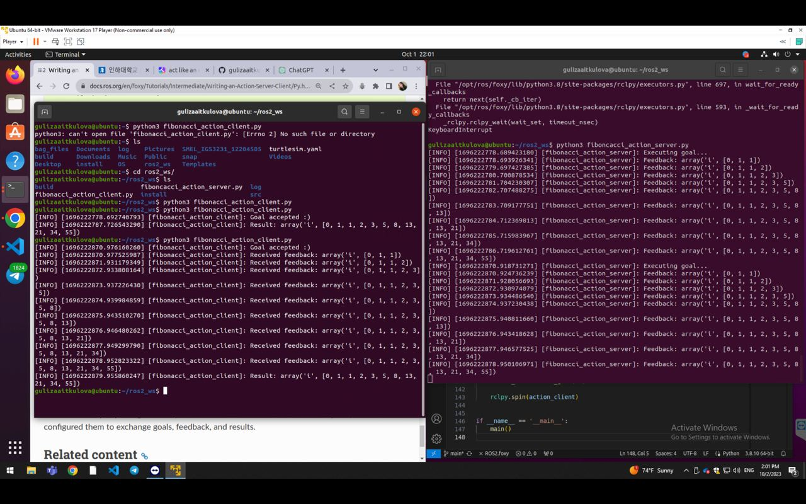

#### Explanation of Terminal Commands - ROS Tutorials - Intermediate - PART 1 - Managing Dependencies with rosdep

The following terminal commands are used for managing dependencies in a ROS (Robot Operating System) project. Below is a breakdown of each command and its purpose:

**1. Initializing rosdep and updating the locally cached rosdistro index:**
```
sudo rosdep init
rosdep update
```
These commands initialize and update `rosdep`, a command-line tool used to install system dependencies required by ROS packages. `rosdep` uses a locally cached index called `rosdistro` to determine the system dependencies needed for each ROS package.

**2. Installing dependencies:**
```
rosdep install --from-paths src -y --ignore-src
```
This command installs the dependencies for the ROS packages located in the `src` directory of your project. The `--from-paths` option specifies the source directory from which to install dependencies. The `-y` option automatically answers "yes" to any prompts during the installation process. The `--ignore-src` option tells `rosdep` to ignore any dependencies that are already installed from source.

By running these commands, we ensure that all the required system dependencies for our ROS project are installed, allowing our project to compile and run successfully.


#### Explanation of Terminal Commands - Part 2 - Creating an action

The following terminal commands are used for creating an action in a ROS 2 (Robot Operating System 2) project. Below is a breakdown of each command and its purpose:

**1. Setting up a workspace and creating a package:**
```
mkdir -p ros2_ws/src
cd ros2_ws/src
ros2 pkg create action_tutorials_interfaces
```
These commands create a workspace directory called `ros2_ws` and a package directory called `action_tutorials_interfaces` inside the `src` directory of the workspace. The `ros2 pkg create` command sets up the basic structure of the package, including necessary files and directories.

**2. Creating an action directory in our ROS 2 package:**
```
cd action_tutorials_interfaces
mkdir action
```
These commands navigate into the `action_tutorials_interfaces` package directory and create a new directory called `action`. This directory will be used to store the action files.

**3. Creating a file called Fibonacci.action:**
```
int32 order
---
int32[] sequence
---
int32[] partial_sequence
```
These lines define the structure of the action called `Fibonacci`. The action has three parts: `order`, `sequence`, and `partial_sequence`. Each part is separated by `---`. The `order` is an integer, while `sequence` and `partial_sequence` are arrays of integers.

**4. Adding code to pass the definition to the rosidl code generation pipeline:**
```
find_package(rosidl_default_generators REQUIRED)

rosidl_generate_interfaces(${PROJECT_NAME}
  "action/Fibonacci.action"
)
```
These lines configure the CMakeLists.txt file in the package directory to use the `rosidl_default_generators` package and generate the interfaces for the `Fibonacci` action. The `${PROJECT_NAME}` variable refers to the name of the current package.

**5. Adding required dependencies to the package.xml file:**
```
<buildtool_depend>rosidl_default_generators</buildtool_depend>

<depend>action_msgs</depend>

<member_of_group>rosidl_interface_packages</member_of_group>
```
These lines add the necessary dependencies to the package.xml file. The `<buildtool_depend>` specifies the dependency on `rosidl_default_generators`. The `<depend>` specifies the dependency on `action_msgs`, which provides the message types for actions. The `<member_of_group>` specifies that this package is a member of the `rosidl_interface_packages` group.

**6. Building the package:**
```
cd ~/ros2_ws
colcon build
```
These commands navigate to the root of the workspace (`ros2_ws`) and build the package using `colcon`. `colcon` is a build tool for ROS 2 that builds multiple packages in a workspace.

**7. Checking that the action built successfully:**
```
. install/setup.bash
ros2 interface show action_tutorials_interfaces/action/Fibonacci
```
These commands source the workspace setup script and use the `ros2 interface show` command to verify that the action definition for `Fibonacci` exists. This command displays the structure of the action, confirming that it was built successfully.


#### Explanation of Terminal Commands - Part 3 - Writing an action server-client in Python

The foloowing terminal commands demonstrate how to write an action server and client using Python in a ROS 2 (Robot Operating System 2) project. Below is a breakdown of each command and its purpose:

**1. Creating a Python file for the Fibonacci Action Server:**
```python
import rclpy
from rclpy.action import ActionServer
from rclpy.node import Node

from action_tutorials_interfaces.action import Fibonacci


class FibonacciActionServer(Node):

    def __init__(self):
        super().__init__('fibonacci_action_server')
        self._action_server = ActionServer(
            self,
            Fibonacci,
            'fibonacci',
            self.execute_callback)

    def execute_callback(self, goal_handle):
        self.get_logger().info('Executing goal...')
        result = Fibonacci.Result()
        return result


def main(args=None):
    rclpy.init(args=args)

    fibonacci_action_server = FibonacciActionServer()

    rclpy.spin(fibonacci_action_server)


if __name__ == '__main__':
    main()
```
This Python code defines an action server for the Fibonacci action. It imports the necessary modules from `rclpy` and `action_tutorials_interfaces`. The `FibonacciActionServer` class extends the `Node` class from `rclpy` and initializes an action server using the `ActionServer` class. The `execute_callback` method is called when a goal is received by the server, and it logs a message and returns a result object of type `Fibonacci.Result()`. The `main` function initializes the ROS 2 Python client library, creates an instance of the `FibonacciActionServer` class, and starts the ROS 2 spin loop.

**2. Running the Python file:**
```
python3 fibonacci_action_server.py
```
This command runs the Python file `fibonacci_action_server.py`. It executes the code defined in the Python file, creating and starting the Fibonacci Action Server.

**3. Sending a goal to the action server:**
```
ros2 action send_goal fibonacci action_tutorials_interfaces/action/Fibonacci "{order: 5}"
```
This command sends a goal to the Fibonacci Action Server using the `ros2 action send_goal` command. It specifies the action `fibonacci` and the action definition `action_tutorials_interfaces/action/Fibonacci`. The goal is provided as a JSON string `"{order: 5}"`, indicating that the Fibonacci sequence up to the 5th term is requested.


**1. Modifying the Fibonacci Action Server to Succeed Immediately:**
```
# modifying the fibonaci_action_server.py file like so:
def execute_callback(self, goal_handle):
    self.get_logger().info('Executing goal...')
    goal_handle.succeed()
    result = Fibonacci.Result()
    return result
```
This modification changes the behavior of the `execute_callback` method in the Fibonacci Action Server. Instead of computing the Fibonacci sequence, it immediately succeeds the goal by calling `goal_handle.succeed()`. This modification is useful for testing the basic functionality of the server.


**2. Restarting the Server and Sending a New Goal:**
```
# restarting the server file and sending a new goal
### result output image - SUCCEEDED
```
After modifying the server code, the server file needs to be restarted. Then, a new goal is sent to the Fibonacci Action Server. The expected result is a successful completion of the goal, as indicated by the `SUCCEEDED` status.

**3. Modifying the Server to Compute and Return the Fibonacci Sequence:**
```
# modifying the server code so that it actually computes and returns the requested Fibonacci sequence:
def execute_callback(self, goal_handle):
    self.get_logger().info('Executing goal...')
    sequence = [0, 1]
    for i in range(1, goal_handle.request.order):
        sequence.append(sequence[i] + sequence[i-1])
    goal_handle.succeed()
    result = Fibonacci.Result()
    result.sequence = sequence
    return result
```
This modification updates the `execute_callback` method of the Fibonacci Action Server to compute and return the requested Fibonacci sequence. It initializes the `sequence` list with the first two Fibonacci numbers and then uses a loop to calculate the remaining numbers based on the requested `order`. The computed `sequence` is stored in the `result.sequence` field and returned in the result object.


**4. Restarting and Sending Another Goal:**
```
# again restarting and sending another goal
### result output image


```
After modifying the server code, the server file needs to be restarted. Then, another goal is sent to the Fibonacci Action Server. The expected result is the successful completion of the goal, and the server will compute and return the Fibonacci sequence based on the requested order.

**5. Modifying the Server to Use Feedback Messages:**
```python
# again modifying the server file to replace the sequence variable, and use a feedback message to store the sequence instead
import time
import rclpy
from rclpy.action import ActionServer
from rclpy.node import Node
from action_tutorials_interfaces.action import Fibonacci

class FibonacciActionServer(Node):
    def __init__(self):
        super().__init__('fibonacci_action_server')
        self._action_server = ActionServer(
            self,
            Fibonacci,
            'fibonacci',
            self.execute_callback)
    def execute_callback(self, goal_handle):
        self.get_logger().info('Executing goal...')
        feedback_msg = Fibonacci.Feedback()
        feedback_msg.partial_sequence = [0, 1]
        for i in range(1, goal_handle.request.order):
            feedback_msg.partial_sequence.append(feedback_msg.partial_sequence[i] + feedback_msg.partial_sequence[i-1])
            self.get_logger().info('Feedback: {0}'.format(feedback_msg.partial_sequence))
            goal_handle.publish_feedback(feedback_msg)
            time.sleep(1)
        goal_handle.succeed()
        result = Fibonacci.Result()
        result.sequence = feedback_msg.partial_sequence
        return result
```
This modification enhances the Fibonacci Action Server to provide feedback messages during the computation of the Fibonacci sequence. It introduces a `feedback_msg` object of type `Fibonacci.Feedback()`, which stores the partial sequence at each iteration. The partial sequence is appended to the `feedback_msg.partial_sequence` list and published as feedback using `goal_handle.publish_feedback()`. A delay of 1 second is added between each iteration to simulate work being done. Finally, the computed `feedback_msg.partial_sequence` is stored in the `result.sequence` field and returned in the result object.


**6. Confirming Feedback Publishing and Sending a Goal with Feedback:**
```
# after restarting the server file we confirm that feedback is now published by using the command line tool with the --feedback option:
ros2 action send_goal --feedback fibonacci action_tutorials_interfaces/action/Fibonacci "{order: 5}"
###result output image
```
After restarting the server file that includes feedback messages, the `ros2 action send_goal` command is used to send a new goal to the Fibonacci Action Server. The `--feedback` option is added to enable feedback tracking. The expected result is the successful completion of the goal, with feedback messages logged and displayed.

**7. Creating a Fibonacci Action Client:**
```python
# creating a new python file called fibonacci_action_client.py with the following content:
import rclpy
from rclpy.action import ActionClient
from rclpy.node import Node
from action_tutorials_interfaces.action import Fibonacci

class FibonacciActionClient(Node):
    def __init__(self):
        super().__init__('fibonacci_action_client')
        self._action_client = ActionClient(self, Fibonacci, 'fibonacci')
    def send_goal(self, order):
        goal_msg = Fibonacci.Goal()
        goal_msg.order = order
        self._action_client.wait_for_server()
        return self._action_client.send_goal_async(goal_msg)

def main(args=None):
    rclpy.init(args=args)
    action_client = FibonacciActionClient()
    future = action_client.send_goal(10)
    rclpy.spin_until_future_complete(action_client, future)

if __name__ == '__main__':
    main()
```
This code introduces a Fibonacci Action Client that sends goals to the Fibonacci Action Server. The `FibonacciActionClient` class extends the `Node` class from `rclpy` and initializes an action client using the `ActionClient` class. The `send_goal` method creates a goal message, sets the desired order, waits for the server, and sends the goal asynchronously using `send_goal_async`. The `main` function initializes the ROS 2 Python client library, creates an instance of the `FibonacciActionClient` class, and spins the node until the future completes.


**8. Running the Server and Client Files:**
```
# running both server and the client files in different terminal windows
python3 fibonacci_action_server.py
python3 fibonacci_action_client.py
### result output image
```
These commands start the Fibonacci Action Server and Fibonacci Action Client in separate terminal windows. The server and client files are run using the `python3` command. The expected result is the successful completion of the goal, with the Fibonacci sequence being computed and displayed.

**9. Modifying the Client to Handle Goal Response and Get the Result:**
```python
# modifying the client file content so that we know when the goal is completed
import rclpy
from rclpy.action import ActionClient
from rclpy.node import Node
from action_tutorials_interfaces.action import Fibonacci

class FibonacciActionClient(Node):
    def __init__(self):
        super().__init__('fibonacci_action_client')
        self._action_client = ActionClient(self, Fibonacci, 'fibonacci')
    def send_goal(self, order):
        goal_msg = Fibonacci.Goal()
        goal_msg.order = order
        self._action_client.wait_for_server()
        self._send_goal_future = self._action_client.send_goal_async(goal_msg)
        self._send_goal_future.add_done_callback(self.goal_response_callback)

    def goal_response_callback(self, future):
        goal_handle = future.result()
        if not goal_handle.accepted:
            self.get_logger().info('Goal rejected :(')
            return
        self.get_logger().info('Goal accepted :)')
        self._get_result_future = goal_handle.get_result_async()
        self._get_result_future.add_done_callback(self.get_result_callback)

    def get_result_callback(self, future):
        result = future.result().result
        self.get_logger().info('Result: {0}'.format(result.sequence))
        rclpy.shutdown()

def main(args=None):
    rclpy.init(args=args)
    action_client = FibonacciActionClient()
    action_client.send_goal(10)
    rclpy.spin(action_client)

if __name__ == '__main__':
    main()
```
This modification enhances the Fibonacci Action Client to handle the response from the server and retrieve the result. The `send_goal` method now adds a callback function `goal_response_callback` to the `send_goal_async` future. This callback is executed when the goal response is received. If the goal is accepted, the `get_result_async` function is called to retrieve the result. The `get_result_callback` function logs and displays the computed Fibonacci sequence. The node is then shut down.


**10. Running the Server and Client Files with Result Logging:**
```
# again running the server and client files
### result output image
```
These commands run the Fibonacci Action Server and Fibonacci Action Client again with the modified client code. The expected result is the successful completion of the goal, with the Fibonacci sequence being computed, logged, and displayed.

**11. Modifying the Client to Handle Feedback Messages:**
#### Explanation of the Code for README File

1. Importing the necessary dependencies:
   - `rclpy`: This is the Python client library for ROS 2 (Robot Operating System 2).
   - `ActionClient` and `Node` from `rclpy.action`: These are classes that provide the functionality to interact with ROS 2 action servers.
   - `Fibonacci` from `action_tutorials_interfaces.action`: This is the action message type defined in the `action` package.

2. Defining the `FibonacciActionClient` class:
   - This class extends the `Node` class and serves as the main client for the Fibonacci action server.
   - It initializes the action client with the appropriate action type and server name.
   - It defines methods for sending a goal, handling goal responses, getting results, and receiving feedback.

3. Implementing the methods:
   - `send_goal`: This method takes an `order` parameter and sends a goal to the action server with the specified order. It also waits for the server to be available before sending the goal.
   - `goal_response_callback`: This method is called when a response is received from the action server after sending a goal. It checks if the goal was accepted and logs the appropriate message.
   - `get_result_callback`: This method is called when the result of the action is available. It retrieves the result, which is the Fibonacci sequence, and logs it.
   - `feedback_callback`: This method is called when feedback is received from the action server. It logs the partial sequence received.

4. Defining the `main` function:
   - This function initializes the ROS 2 client library, creates an instance of the `FibonacciActionClient` class, and sends a goal with an order of 10.
   - It then enters a loop to spin the action client until the program is interrupted.

5. Running the code:
   - The code can be executed by running the Python script.
   - Before running the code, make sure that the Fibonacci action server is running.




### PART 4 - Composing multiple nodes in a single process

This section provides an overview of the concept of composing multiple nodes in a single process. It emphasizes the importance of understanding the available component types that can be used for this purpose.

### Seeing What Components are Registered and Available in the Workspace

This section contains the actual code that performs the inspection of registered and available component types in the ROS2 workspace. The code utilizes the `ros2 component types` command, which is a built-in command in the ROS2 framework. When executed, this command provides a list of all the component types that are currently registered and available in the workspace.


### Starting the Component Container and Verifying its Status

This section demonstrates how to start the component container using the `ros2 run rclcpp_components component_container` command in the first terminal. It also shows how to verify the running status of the container using the `ros2 component list` command in the second terminal.

### Loading Components and Inspecting the Container State

This section illustrates how to load individual components into the component container. It demonstrates loading the talker and listener components using the `ros2 component load` command. After loading the components, the state of the container is inspected using the `ros2 component list` command.

### Run-time Composition Using ROS Services

This section showcases run-time composition using ROS services with a server and client. It demonstrates loading the server and client components into the component container using the `ros2 component load` command.

### Compile-time Composition

This section demonstrates compile-time composition using the `ros2 run composition manual_composition` command.

### Run-time Composition Using dlopen

This section showcases run-time composition using `dlopen` to dynamically load components. It uses the `ros2 run composition dlopen_composition` command, specifying the paths to the `libtalker_component.so` and `liblistener_component.so` libraries.

### Composition Using Launch Actions

This section demonstrates composition using launch actions by executing the `ros2 launch composition composition_demo.launch.py` command.

### Unloading Components

This section illustrates how to unload components from the component container. It shows how to start the component container, verify its status, load the talker and listener components, and then unload them using the `ros2 component unload` command.

### Remapping Container Name and Namespace

This section showcases how to remap the container name and namespace. It uses the `ros2 run rclcpp_components component_container --ros-args -r __node:=MyContainer -r __ns:=/ns` command to start the component container with a custom name and namespace. Then, it demonstrates loading the listener component into the custom namespace using the `ros2 component load` command.

### Remap Component Names and Namespaces

This section demonstrates how to remap component names and namespaces individually or together. It shows examples of remapping the node name, namespace, or both using the `ros2 component load` command.

### Passing Parameter Values into Components

This section illustrates how to pass parameter values into components using the `-p` option with the `ros2 component load` command. It provides an example of loading the `Cam2Image` component with the `burger_mode` parameter set to `true`.

### Passing Additional Arguments into Components

This section demonstrates how to pass additional arguments into components using the `-e` option with the `ros2 component load` command. It provides an example of loading the talker component with the `use_intra_process_comms` argument set to `true`.

The following are the outputs:


 
 
 

 
 
 


#### PART 5 - Launch

This code provides the necessary steps to create and run a launch file for the `turtlesim` package in ROS2. The launch file allows you to start multiple instances of the `turtlesim_node` and the `mimic` node with specified parameters and remappings.

### Part 5.1 - Creating a launch file
To begin, create a new directory called `launch` using the command `mkdir launch`. This directory will hold the launch file.

Inside the `launch` directory, create a new file called `turtlesim_mimic_launch.py` and add the following code:

```python
from launch import LaunchDescription
from launch_ros.actions import Node

def generate_launch_description():
    return LaunchDescription([
        Node(
            package='turtlesim',
            namespace='turtlesim1',
            executable='turtlesim_node',
            name='sim'
        ),
        Node(
            package='turtlesim',
            namespace='turtlesim2',
            executable='turtlesim_node',
            name='sim'
        ),
        Node(
            package='turtlesim',
            executable='mimic',
            name='mimic',
            remappings=[
                ('/input/pose', '/turtlesim1/turtle1/pose'),
                ('/output/cmd_vel', '/turtlesim2/turtle1/cmd_vel'),
            ]
        )
    ])
```

This code defines a `generate_launch_description` function that returns a `LaunchDescription` object. Within this object, three `Node` instances are defined:

1. The first `Node` is launched from the `turtlesim` package with the namespace `turtlesim1`, the executable `turtlesim_node`, and the name `sim`.

2. The second `Node` is also launched from the `turtlesim` package, but with the namespace `turtlesim2` and the same executable and name as the first `Node`.

3. The third `Node` is launched from the `turtlesim` package with the executable `mimic`, the name `mimic`, and two remappings: `/input/pose` is remapped to `/turtlesim1/turtle1/pose`, and `/output/cmd_vel` is remapped to `/turtlesim2/turtle1/cmd_vel`.

To run the launch file, open a terminal and execute the command `ros2 launch turtlesim_mimic_launch.py`.

To see the system in action, open a new terminal and run the following command to make the first turtle move:

```bash
ros2 topic pub -r 1 /turtlesim1/turtle1/cmd_vel geometry_msgs/msg/Twist "{linear: {x: 2.0, y: 0.0, z: 0.0}, angular: {x: 0.0, y: 0.0, z: -1.8}}"
```

This command publishes a message to the `/turtlesim1/turtle1/cmd_vel` topic, instructing the turtle to move linearly and rotate. Adjust the values in the message to change the turtle's movement.

To get a better idea of the relationship between the nodes in the launch file, you can visualize the graph by running the command `rqt_graph` in a terminal. This will display a graphical representation of the ROS2 graph, showing the connections between different nodes and topics.

Here are the screenshots of each step's output:


### Part 5.2 - Integrating Launch Files into ROS 2 Packages

To begin, create a new workspace by executing the following commands:

```bash
mkdir -p launch_ws/src
cd launch_ws/src
```

This creates a new directory structure for your workspace.

Next, create a new ROS 2 package called `py_launch_example` using the command `ros2 pkg create py_launch_example --build-type ament_python`. This command sets up the necessary files and directories for your package.

#### Creating the Structure to Hold Launch Files

To create the structure to hold launch files, you need to modify the `setup.py` file in your package. Open the `setup.py` file and make the following changes:

```python
import os
from glob import glob
from setuptools import setup

package_name = 'py_launch_example'

setup(
    # Other parameters ...
    data_files=[
        # ... Other data files
        # Include all launch files.
        (os.path.join('share', package_name, 'launch'), glob(os.path.join('launch', '*launch.[pxy][yma]*')))
    ]
)
```

This modification ensures that all the launch files in the `launch` directory of your package are included when the package is built.

Now, create a file named `my_script_launch.py` inside the `launch` directory of your package and add the following content:

```python
import launch
import launch_ros.actions

def generate_launch_description():
    return launch.LaunchDescription([
        launch_ros.actions.Node(
            package='demo_nodes_cpp',
            executable='talker',
            name='talker'),
  ])
```

This code defines a `generate_launch_description` function that returns a `LaunchDescription` object. Inside this object, a `Node` from the `demo_nodes_cpp` package is defined. The node is launched with the executable `talker` and the name `talker`.

#### Building and Running the Launch File

To build the package, execute the command `colcon build` in the root of your workspace. This command compiles and builds the package along with its dependencies.

To run the launch file, execute the command `ros2 launch` in a terminal. This will launch the nodes defined in the `my_script_launch.py` file.

Ensure that you have the necessary dependencies installed and that you have set up your ROS 2 environment before running the code.

The integration of launch files into ROS 2 packages allows you to easily configure and run complex systems by defining and launching multiple nodes with specific parameters. It helps streamline the development and deployment process in ROS 2.

Here are the relevant screenshots:
 
 


### Part 5.3 - Using Substitutions

To begin, create a new ROS 2 package called `launch_tutorial` using the command `ros2 pkg create launch_tutorial --build-type ament_python`. This command sets up the necessary files and directories for your package.

Next, create a directory named `launch` inside the `launch_tutorial` package by executing the command `mkdir launch_tutorial/launch`. This directory will hold the launch files for your package.

#### Modifying the setup.py File

To include the launch files in your package, you need to modify the `setup.py` file. Open the `setup.py` file and make the following changes:

```python
import os
from glob import glob
from setuptools import setup

package_name = 'launch_tutorial'

setup(
    # Other parameters ...
    data_files=[
        # ... Other data files
        # Include all launch files.
        (os.path.join('share', package_name, 'launch'), glob(os.path.join('launch', '*launch.[pxy][yma]*')))
    ]
)
```

This modification ensures that all the launch files in the `launch` directory of your package are included when the package is built.

#### Creating the Main Launch File

Create a file named `example_main.launch.py` inside the `launch` directory of your package and add the following content:

```python
from launch_ros.substitutions import FindPackageShare

from launch import LaunchDescription
from launch.actions import IncludeLaunchDescription
from launch.launch_description_sources import PythonLaunchDescriptionSource
from launch.substitutions import PathJoinSubstitution, TextSubstitution


def generate_launch_description():
    colors = {
        'background_r': '200'
    }

    return LaunchDescription([
        IncludeLaunchDescription(
            PythonLaunchDescriptionSource([
                PathJoinSubstitution([
                    FindPackageShare('launch_tutorial'),
                    'launch',
                    'example_substitutions.launch.py'
                ])
            ]),
            launch_arguments={
                'turtlesim_ns': 'turtlesim2',
                'use_provided_red': 'True',
                'new_background_r': TextSubstitution(text=str(colors['background_r']))
            }.items()
        )
    ])
```

This code defines the `generate_launch_description` function that returns a `LaunchDescription` object. Inside this object, an `IncludeLaunchDescription` action is used to include another launch file called `example_substitutions.launch.py`. The launch_arguments are set to provide values for the substitutions used in the included launch file.

#### Creating the Substitute Launch File

Create a file named `example_substitutions.launch.py` inside the `launch` directory of your package and add the following content:

```python
from launch_ros.actions import Node

from launch import LaunchDescription
from launch.actions import DeclareLaunchArgument, ExecuteProcess, TimerAction
from launch.conditions import IfCondition
from launch.substitutions import LaunchConfiguration, PythonExpression


def generate_launch_description():
    turtlesim_ns = LaunchConfiguration('turtlesim_ns')
    use_provided_red = LaunchConfiguration('use_provided_red')
    new_background_r = LaunchConfiguration('new_background_r')

    turtlesim_ns_launch_arg = DeclareLaunchArgument(
        'turtlesim_ns',
        default_value='turtlesim1'
    )
    use_provided_red_launch_arg = DeclareLaunchArgument(
        'use_provided_red',
        default_value='False'
    )
    new_background_r_launch_arg = DeclareLaunchArgument(
        'new_background_r',
        default_value='200'
    )

    turtlesim_node = Node(
        package='turtlesim',
        namespace=turtlesim_ns,
        executable='turtlesim_node',
        name='sim'
    )
    spawn_turtle = ExecuteProcess(
        cmd=[
            'ros2 service call',
            turtlesim_ns,
            '/spawn',
            'turtlesim/srv/Spawn',
            '"{x: 2, y: 2, theta: 0.2}"'
        ],
        shell=True
    )
    change_background_r = ExecuteProcess(
        cmd=[
            'ros2 param set',
            turtlesim_ns,
            '/sim background_r',
            '120'
        ],
        shell=True
    )
    change_background_r_conditioned = ExecuteProcess(
        condition=IfCondition(
            PythonExpression([
                new_background_r,
                ' == 200',
                ' and ',
                use_provided_red
            ])
        ),
        cmd=[
            'ros2 param set',
            turtlesim_ns,
            '/sim background_r',
            new_background_r
        ],
        shell=True
    )

    return LaunchDescription([
        turtlesim_ns_launch_arg,
        use_provided_red_launch_arg,
        new_background_r_launch_arg,
        turtlesim_node,
        spawn_turtle,
        change_background_r,
        TimerAction(
            period=2.0,
            actions=[change_background_r_conditioned],
        )
    ])
```

This code defines the `generate_launch_description` function that returns a `LaunchDescription` object. Inside this object, various actions are defined, including `Node`, `ExecuteProcess`, and `TimerAction`. These actions perform tasks such as launching a `turtlesim_node`, calling a service to spawn a turtle, and setting parameters dynamically based on conditions.

#### Building and Launching the Package

To build the package, execute the command `colcon build` in the root of your workspace. This command compiles and builds the package along with its dependencies.

Before launching the file, make sure to source the workspace by executing the command `source/install/local_setup.bash && source/install/setup.bash`. This ensures that the necessary environment variables are set.

To launch the main file, execute the command `ros2 launch launch_tutorial example_main.launch.py`.

To change the arguments of the launch, execute the command `ros2 launch launch_tutorial example_substitutions.launch.py --show-args` to see the available arguments. Then, launch the file with the desired arguments, for example: `ros2 launch launch_tutorial example_substitutions.launch.py turtlesim_ns:='turtlesim3' use_provided_red:='True' new_background_r:=200`.

Ensure that you have the necessary dependencies installed and that you have set up your ROS 2 environment before running the code.

Using substitutions in ROS 2 launch files allows for dynamic configuration and parameterization, making it easier to reuse and adapt launch files for different scenarios and setups. It provides flexibility and simplifies the launch process in ROS 2.

Here are the screenshots:
 
 
 


#### Part 5.4 - Using event handlers

The code is a Python script that demonstrates the usage of event handlers in ROS 2. It creates a launch file called `example_event_handlers.launch.py` in the `launch` directory of the `launch_tutorial` package.

The code imports various modules and classes from the `launch_ros.actions`, `launch`, `launch.actions`, `launch.conditions`, `launch.event_handlers`, and `launch.substitutions` packages. These modules and classes are used to define launch actions, launch conditions, event handlers, and launch substitutions.

The `generate_launch_description()` function is defined to generate the launch description. It uses `LaunchConfiguration` to declare launch arguments, `Node` to define a TurtleSim node, and `ExecuteProcess` to execute ROS 2 commands. The launch arguments `turtlesim_ns`, `use_provided_red`, and `new_background_r` are declared, and their default values are set.

The launch description includes the following actions:

1. `turtlesim_ns_launch_arg`: Declares the `turtlesim_ns` argument.
2. `use_provided_red_launch_arg`: Declares the `use_provided_red` argument.
3. `new_background_r_launch_arg`: Declares the `new_background_r` argument.
4. `turtlesim_node`: Launches a TurtleSim node with the specified namespace.
5. `RegisterEventHandler(OnProcessStart)`: Registers an event handler that runs when the `turtlesim_node` starts. It logs a message and executes the `spawn_turtle` action.
6. `RegisterEventHandler(OnProcessIO)`: Registers an event handler that runs when the `spawn_turtle` action outputs to stdout. It logs the output.
7. `RegisterEventHandler(OnExecutionComplete)`: Registers an event handler that runs when the `spawn_turtle` action completes execution. It logs a message, executes the `change_background_r` action, and schedules the `change_background_r_conditioned` action to run every 2 seconds.
8. `RegisterEventHandler(OnProcessExit)`: Registers an event handler that runs when the `turtlesim_node` exits. It logs a message and emits a `Shutdown` event.
9. `RegisterEventHandler(OnShutdown)`: Registers an event handler that runs when the launch is asked to shutdown. It logs a message with the reason for shutdown.

To run this code, you would need to follow these steps:

1. Build the package using `colcon build` command from the root of the workspace.
2. Source the workspace using `source install/local_setup.bash` or `source install/setup.bash` command.
3. Launch the file using `ros2 launch launch_tutorial example_event_handlers.launch.py turtlesim_ns:='turtlesim3' use_provided_red:='True' new_background_r:=200` command. You can modify the launch arguments as needed.

Here are the screenshots:


#### README file explanation for the provided code

The provided code is a collection of launch files and configuration files for managing large projects in the context of ROS 2 (Robot Operating System 2). The code is organized into different files, each serving a specific purpose. Let's go through each file and understand its functionality.

#### Part 5.5 - Managing large projects

##### launch_turtlesim.launch.py
This file is located in the `launch` directory of the `launch_tutorial` package. It is a launch file that includes other launch files and sets up the launch configuration for the entire project. This file is responsible for launching multiple nodes and configuring their parameters. 

The launch file starts by importing necessary modules and packages such as `os` and `ament_index_python.packages`. It then defines a function `generate_launch_description()` that returns a `LaunchDescription` object.

Inside the `generate_launch_description()` function, the launch file includes other launch files using the `IncludeLaunchDescription` action. The included launch files are:
- `turtlesim_world_1.launch.py`
- `turtlesim_world_2.launch.py`
- `broadcaster_listener.launch.py`
- `mimic.launch.py`
- `fixed_broadcaster.launch.py`
- `turtlesim_rviz.launch.py`

These included launch files define and launch nodes with different configurations and parameters.

Finally, the `generate_launch_description()` function returns a `LaunchDescription` object that includes all the included launch files.

##### turtlesim_world_1.launch.py
This file is located in the `launch` directory of the `launch_tutorial` package. It is a launch file that launches the `turtlesim_node` from the `turtlesim` package with specified parameters.

The file starts by importing necessary modules and packages such as `LaunchDescription`, `DeclareLaunchArgument`, `LaunchConfiguration`, `TextSubstitution`, and `Node` from `launch` and `launch_ros` packages.

The `generate_launch_description()` function defines and returns a `LaunchDescription` object. It declares three launch arguments: `background_r`, `background_g`, and `background_b`, with default values specified using `TextSubstitution`. These arguments represent the RGB values for the background color of the `turtlesim` simulation.

The `LaunchDescription` object includes a `Node` action that launches the `turtlesim_node` with the specified parameters.

##### turtlesim_world_2.launch.py
This file is located in the `launch` directory of the `launch_tutorial` package. It is a launch file that launches the `turtlesim_node` from the `turtlesim` package with a different namespace and configuration file.

The file starts by importing necessary modules and packages such as `os` and `ament_index_python.packages`.

The `generate_launch_description()` function defines and returns a `LaunchDescription` object. It first constructs the path to the configuration file `turtlesim.yaml` using `os.path.join` and `get_package_share_directory` functions.

The `LaunchDescription` object includes a `Node` action that launches the `turtlesim_node` with a different namespace (`turtlesim2`) and the specified configuration file.

##### turtlesim.yaml
This file is located in the `config` directory of the `launch_tutorial` package. It is a configuration file for the `turtlesim_node` launched in `turtlesim_world_2.launch.py`.

The file defines the ROS parameters for the `turtlesim_node` under the namespace `/turtlesim2/sim`. It specifies the background color of the simulation by setting the values of `background_r`, `background_g`, and `background_b`.

##### turtlesim_world_3.launch.py
This file is located in the `launch` directory of the `launch_tutorial` package. It is similar to `turtlesim_world_2.launch.py` but with an additional node.

The file imports necessary modules and packages and defines the `generate_launch_description()` function. The function constructs the path to the configuration file and includes a `Node` action that launches the `turtlesim_node` with a different namespace and the specified configuration file.

##### broadcaster_listener.launch.py
This file is located in the `launch` directory of the `launch_tutorial` package. It is a launch file that launches multiple nodes related to the turtle broadcaster and listener.

The file imports necessary modules and packages and defines the `generate_launch_description()` function. The function returns a `LaunchDescription` object that includes multiple `Node` actions for launching the turtle broadcaster and listener nodes.

##### mimic.launch.py
This file is located in the `launch` directory of the `launch_tutorial` package. It is a launch file that launches the `mimic` node from the `turtlesim` package.

The file imports necessary modules and packages and defines the `generate_launch_description()` function. The function returns a `LaunchDescription` object that includes a `Node` action for launching the `mimic` node with remappings.

##### turtlesim_rviz.launch.py
This file is located in the `launch` directory of the `launch_tutorial` package. It is a launch file that launches the `rviz2` node with a specific configuration.

The file imports necessary modules and packages and defines the `generate_launch_description()` function. The function constructs the path to the RViz configuration file and returns a `LaunchDescription` object that includes a `Node` action for launching the `rviz2` node with the specified configuration.

##### fixed_broadcaster.launch.py
This file is located in the `launch` directory of the `launch_tutorial` package. It is a launch file that launches the `fixed_frame_tf2_broadcaster` node from the `turtle_tf2_py` package.

The file imports necessary modules and packages and defines the `generate_launch_description()` function. The function returns a `LaunchDescription` object that includes a `Node` action for launching the `fixed_frame_tf2_broadcaster` node.

##### setup.py
This file is not provided in the code snippet, but it is mentioned in the README file. It is a Python script used for packaging and distributing the ROS package. The script includes information about the package, such as its name, version, dependencies, and data files to be installed.

##### Building and running
The last section of the README file provides instructions for building and running the project using `colcon`, a build tool for ROS 2 packages. The commands `colcon build`, `source install/local_setup.bash`, `source install/setup.bash`, and `ros2 launch launch_tutorial launch_turtlesim.launch.py` are used to build the project, set up the environment, and launch the project.

Here are the relevant screenshots:


#### Explanation for Part 6.1 - Introducing tf2

Here is a breakdown of the code and its instructions:

1. **Installing Dependencies**: The first step is to install the necessary packages and dependencies for running the demo. This is done using the `sudo apt-get install` command to install the following ROS packages:
   - `ros-foxy-turtle-tf2-py`: Package for working with turtle transformations using tf2 in Python.
   - `ros-foxy-tf2-tools`: Package containing tools for working with tf2.
   - `ros-foxy-tf-transformations`: Package providing various transformation functions for tf2.

2. **Running the Demo**: After installing the dependencies, the next step is to launch the turtle_tf2_py demo. This is done using the `ros2 launch` command with the argument `turtle_tf2_demo.launch.py`. The demo is launched twice in the provided code, which might be a mistake or intentional depending on the specific requirements.

3. **Creating a Diagram**: Once the demo is running, the code instructs to use the `ros2 run` command with the `tf2_tools` package to create a diagram of the tf2 frames. The `view_frames.py` script is executed to generate the diagram.

4. **Looking at Transformations**: After creating the diagram, the code instructs to use the `ros2 run` command with the `tf2_ros` package to examine the transform between the `turtle2` frame and the `turtle1` frame. The `tf2_echo` script is executed with the arguments `turtle2` and `turtle1` to display the transformation information.

5. **Using rviz for Visualization**: Finally, the code instructs to use the `ros2 run` command with the `rviz2` package to launch the rviz visualization tool. The `-d` option is used to specify the rviz configuration file `turtle_rviz.rviz`, which is located in the `turtle_tf2_py` package. This allows for visualizing the tf2 frames and their transformations.


The screenshots:
 
 
 
 
 


#### Explanation for Part 6.2 - Writing a static broadcaster in Python

The code is a set of instructions for writing and building a static broadcaster in ROS (Robot Operating System) using Python. The static broadcaster is responsible for publishing static transformations between coordinate frames in a ROS system, allowing other nodes to access and use these transformations.

Here is a breakdown of the code and its instructions:

1. **Creating a Workspace**: The first step is to create a new workspace for the project. This is done using the `mkdir -p` command to create the directory `learning_tf2/src` in the home directory (`~/`). Then, the `cd` command is used to navigate to the `src` directory.

2. **Creating a Package**: After navigating to the `src` directory, the code instructs to create a new ROS package inside the workspace using the `ros2 pkg create` command. The package is named `learning_tf2_py` and is set to be built with the `ament_python` build type.

3. **Downloading Example Code**: Once the package is created, the code instructs to navigate to the package's directory `src/learning_tf2_py/learning_tf2_py` and download the example static broadcaster code from a GitHub repository. This is done using the `wget` command to retrieve the code file `static_turtle_tf2_broadcaster.py`.

4. **Modifying Package Files**: After downloading the example code, the package's files need to be modified. The code instructs to navigate back to the `src/learning_tf2_py` directory and open the `package.xml` file. The file is modified by adding a description, maintainer information, license, and dependencies based on the node's import statements. The dependencies include `geometry_msgs`, `python3-numpy`, `rclpy`, `tf2_ros_py`, and `turtlesim`.

5. **Modifying setup.py**: After modifying the `package.xml` file, the code instructs to modify the `setup.py` file. The code is added between the `console_scripts` brackets to create an executable for the static broadcaster node.

6. **Building with rosdep**: Once the package files are modified, the code instructs to use the `rosdep` command to install the package's dependencies. The `rosdep install` command is used with the options `-i` to install the dependencies recursively, `--from-path src` to specify the package's source directory, `--rosdistro foxy` to specify the ROS distribution, and `-y` to automatically answer yes to any prompts.

7. **Building the Package**: After installing the dependencies, the code instructs to build the new package using the `colcon build` command. The `--packages-select` option is used to specify the `learning_tf2_py` package.

8. **Running the Static Broadcaster**: Once the package is built, the code instructs to open a new terminal and source the setup file using the `. install/setup.bash` command. Then, the static broadcaster node is run using the `ros2 run` command with the arguments `learning_tf2_py static_turtle_tf2_broadcaster` followed by the arguments for the broadcaster node (`mystaticturtle 0 0 1 0 0 0`).

9. **Echoing the tf_static Topic**: After running the static broadcaster, the code instructs to use the `ros2 topic echo` command to display the messages on the `/tf_static` topic. The `--qos-reliability` and `--qos-durability` options are used to specify the quality of service settings for the topic.

10. **Running the static_transform_publisher**: Finally, the code instructs to use the `ros2 run` command to run the `static_transform_publisher` utility. This utility is used to manually publish static transformations between frames in a ROS system. The utility is executed with the arguments `x y z yaw pitch roll frame_id child_frame_id`, which define the translation and rotation values for the transformation.

The provided code and instructions aim to guide users through the process of writing, building, and running a static broadcaster in ROS using Python. The README file should provide the necessary guidance for setting up the workspace, creating the package, modifying the necessary files, building the package, and running the static broadcaster node.

The screenshots:


#### Part 6.3 - Writing a broadcaster in Python

This code is for creating a broadcaster in Python using the ROS 2 (Robot Operating System 2) framework. The broadcaster is responsible for publishing transformation data between different coordinate frames in a ROS 2 system.

### Setup

1. The first step is to create a new workspace called "learning_tf2".

2. Next, the code for the broadcaster is downloaded using the `wget` command from the provided GitHub URL.

3. The `setup.py` file needs to be modified to include the broadcaster as a console script. This is done by adding the following line within the console_scripts brackets: `'turtle_tf2_broadcaster = learning_tf2_py.turtle_tf2_broadcaster:main',`

4. A new folder called "launch" needs to be created within the workspace. Inside this folder, a new file called "turtle_tf2_demo.py" needs to be created. The contents of this file should include the following code:
```python
from launch import LaunchDescription
from launch_ros.actions import Node

def generate_launch_description():
    return LaunchDescription([
        Node(
            package='turtlesim',
            executable='turtlesim_node',
            name='sim'
        ),
        Node(
            package='learning_tf2_py',
            executable='turtle_tf2_broadcaster',
            name='broadcaster1',
            parameters=[
                {'turtlename': 'turtle1'}
            ]
        ),
    ])
```

5. The `package.xml` file needs to be modified to include the dependencies for launching ROS 2 nodes. This is done by adding the following lines:
```xml
<exec_depend>launch</exec_depend>
<exec_depend>launch_ros</exec_depend>
```

6. The `setup.py` file needs to be modified to include the launch files in the package. This is done by adding the following lines:
```python
data_files=[
    ...
    (os.path.join('share', package_name, 'launch'), glob(os.path.join('launch', '*launch.[pxy][yma]*'))),
],
```
Note: The ellipsis (...) represents any existing entries in the `data_files` list.

### Building and Running

1. The dependencies for the package need to be installed using the `rosdep` command. This is done by running the following command:
```
rosdep install -i --from-path src --rosdistro foxy -y
```

2. The package needs to be built using the `colcon` command. Only the package `learning_tf2_py` needs to be selected for building:
```
colcon build --packages-select learning_tf2_py
```

3. The environment needs to be sourced to set up the newly built package:
```
. install/setup.bash
```

4. The ROS 2 launch file can be executed using the following command:
```
ros2 launch learning_tf2_py turtle_tf2_demo.launch.py
```

5. To manually control the turtle in the simulation, the following command can be run in a separate terminal:
```
ros2 run turtlesim turtle_teleop_key
```

6. To view the transformation data being published by the broadcaster, the following command can be run in a separate terminal:
```
ros2 run tf2_ros tf2_echo world turtle1
```

These steps will set up and run the broadcaster in Python using ROS 2, allowing for the transformation data to be published and visualized.

The screenshots:

 
 
 
 


