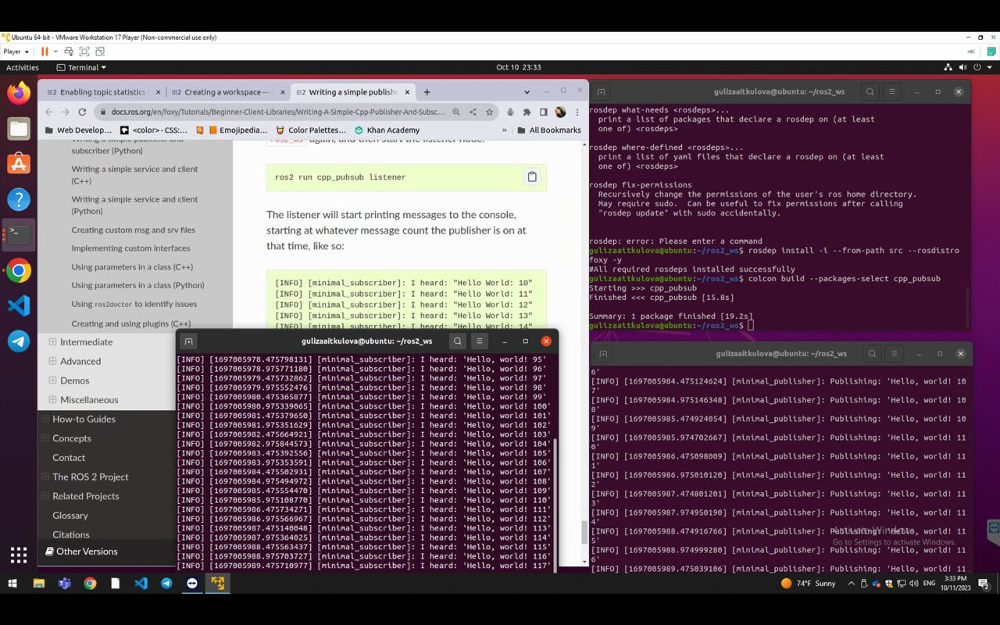

#### README - Part 1

This README file provides a description of the shell script used to setup a ROS2 workspace and create a package for writing a simple publisher and subscriber in C++. The script automates the process of creating the workspace, downloading the example code for the publisher and subscriber, and provides instructions for manually modifying the package.xml file.

The shell script starts by creating a new ROS2 workspace directory named `ros2_ws` and navigating into it. Inside the workspace, a `src` directory is created, and the script moves into it. 

Next, the script creates a new package named `cpp_pubsub` using the `ros2 pkg create` command with the `ament_cmake` build type. This package will be used to contain the publisher and subscriber code.

After creating the package, the script navigates into the `cpp_pubsub/src` directory and downloads the example talker code from the ROS2 examples repository. The talker code is saved as `publisher_member_function.cpp` using the `wget` command. 

Similarly, the script downloads the example listener code from the ROS2 examples repository and saves it as `subscriber_member_function.cpp` using the `wget` command.

The final step mentioned in the script is to manually modify the `package.xml` file. This step is not automated by the script and should be done following the guidelines provided in the README file. Please refer to the README file for detailed instructions on how to modify the `package.xml` file.

Make sure to execute the script in a terminal with the appropriate permissions and ensure that the necessary dependencies are installed for running ROS2.

After running the 1st shell script file, please do the following before running the next shell script file.

#### Adding dependencies
Navigate one level back to the ros2_ws/src/cpp_pubsub directory, where the CMakeLists.txt and package.xml files have been created for you.

Open package.xml with your text editor.

Make sure to fill in the <description>, <maintainer> and <license> tags:

<description>Examples of minimal publisher/subscriber using rclcpp</description>
<maintainer email="you@email.com">Your Name</maintainer>
<license>Apache License 2.0</license>

Add a new line after the ament_cmake buildtool dependency and paste the following dependencies corresponding to your node’s include statements:

<depend>rclcpp</depend>
<depend>std_msgs</depend>

This declares the package needs rclcpp and std_msgs when its code is built and executed.

Make sure to save the file.

##### Running the second shell script file

#### Shell Script README

Here is the description of the shell script. It is used to compile and build a ROS2 package containing a simple publisher and subscriber in C++. The script automates the process of setting up the necessary dependencies, creating a `CMakeLists.txt` file, and building the package using `colcon`.

The script starts by navigating to the directory `/ros2_ws/src/cpp_pubsub`, where the package containing the publisher and subscriber code is located.

Next, the script uses the `echo` command to write the content for the `CMakeLists.txt` file. The `CMakeLists.txt` file is responsible for defining the build configuration and dependencies for the package. The content being echoed includes the minimum required version of CMake, the project name, the default C++ standard, compiler options, and the necessary dependencies (ament_cmake, rclcpp, and std_msgs). It also defines the talker and listener executables and their dependencies. Finally, it specifies the installation destination for the executables.

After creating the `CMakeLists.txt` file, the script changes directory to the root of the workspace (`~/ros2_ws`).

Next, the script uses the `rosdep` command to install the necessary dependencies specified in the package. It uses the `--from-path` option to specify the source directory (`src`), the `--rosdistro` option to specify the ROS distribution (`foxy`), and the `-y` option to automatically answer yes to any prompts.

Finally, the script uses the `colcon` command to build the package. It uses the `--packages-select` option to specify the package to build (`cpp_pubsub`).

Please make sure to execute the script in a terminal with the appropriate permissions and ensure that the necessary dependencies are installed for running ROS2.

##### Running the nodes

After running the 1st shell script file, adding dependencies manually, and then running the 2nd shell script file, you will now run the nodes.

Open a new terminal, navigate to ros2_ws, and source the setup files:

. install/setup.bash

Now run the talker node:

ros2 run cpp_pubsub talker

The terminal should start publishing info messages every 0.5 seconds, like so:
[INFO] [minimal_publisher]: Publishing: "Hello World: 0"
[INFO] [minimal_publisher]: Publishing: "Hello World: 1"
[INFO] [minimal_publisher]: Publishing: "Hello World: 2"
[INFO] [minimal_publisher]: Publishing: "Hello World: 3"
[INFO] [minimal_publisher]: Publishing: "Hello World: 4"

Open another terminal, source the setup files from inside ros2_ws again, and then start the listener node:
ros2 run cpp_pubsub listener

The listener will start printing messages to the console, starting at whatever message count the publisher is on at that time, like so:
[INFO] [minimal_subscriber]: I heard: "Hello World: 10"
[INFO] [minimal_subscriber]: I heard: "Hello World: 11"
[INFO] [minimal_subscriber]: I heard: "Hello World: 12"
[INFO] [minimal_subscriber]: I heard: "Hello World: 13"
[INFO] [minimal_subscriber]: I heard: "Hello World: 14"

Enter Ctrl+C in each terminal to stop the nodes from spinning.

Here is my output:
