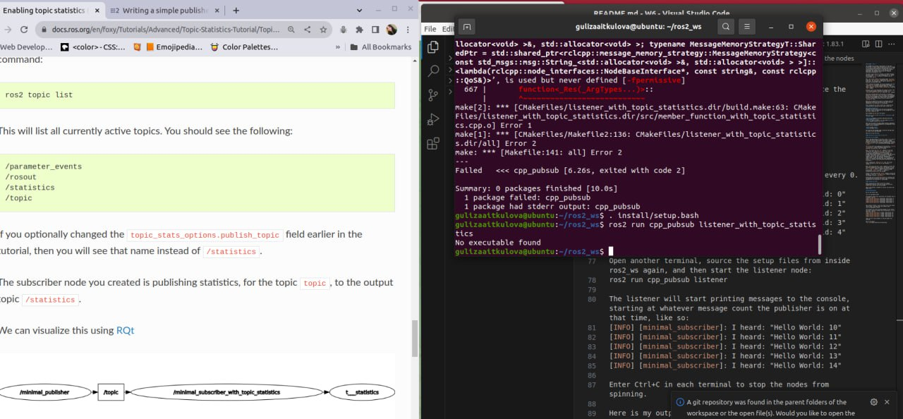

#### README - ROS tutorials - Advanced - Enabling topic statistics  (C++)

The shell script performs the following actions:

Navigates to the required folder ros2_ws/src/cpp_pubsub/src.

Downloads the example talker code, but this line is commented out because the link provided is not working. Instead, you need to manually copy the W6_1.2/member_function_with_topic_statistics.cpp file into the ros2_ws/src/cpp_pubsub/src folder.

Adds the listener_with_topic_statistics executable to the CMakeLists.txt file in the ros2_ws/src/cpp_pubsub directory. This executable depends on rclcpp and std_msgs libraries.

Finally, the script suggests running the nodes and observing the topic statistics.

When I tried to build and run the topic statistics node, I encountered an error that I couldn't fix. But the talker and the listener nodes are still working

In order to try build and run please follow the instructions below. 

Go to the root of the workspace
cd ~/ros2_ws

Check for the rosdep dependencies
rosdep install -i --from-path src --rosdistro foxy -y

Build the packages
colcon build --packages-select cpp_pubsub

For each node please open a new terminal window and run the following commands

Source the setup
. install/setup.bash

Run the nodes 
ros2 run cpp_pubsub listener_with_topic_statistics

ros2 run cpp_pubsub talker

Open a new window

ros2 topic list

This will list all currently active topics. You should see the following:

/parameter_events
/rosout
/statistics
/topic

