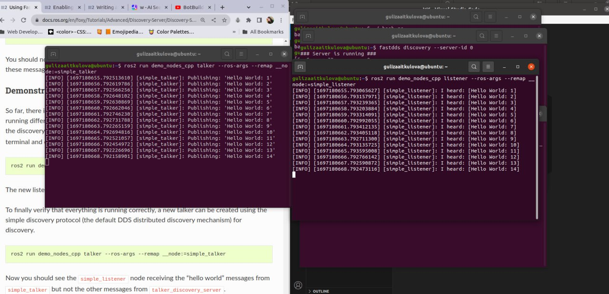

#### Readme - ROS Discovery Server -Advanced ROS Tutorial
#### 12204505 Guliza Aitkulova

This README file provides instructions on how to use the code provided to set up and run a ROS Discovery Server using Fast DDS as the discovery protocol.

### Prerequisites
- ROS 2 installed and configured on your system.
- Fast DDS installed on your system.

### Instructions

1. Clone the repository containing the code for the ROS Discovery Server.

2. Open a terminal and navigate to the directory where the code is located.

3. Run the following command to set up the discovery server:
   ```
   fastdds discovery --server-id 0
   ```

4. Launch the listener node by setting the environment variable and running the listener command:
   ```
   export ROS_DISCOVERY_SERVER=127.0.0.1:11811
   ros2 run demo_nodes_cpp listener --ros-args --remap __node:=listener_discovery_server
   ```

5. Run the talker node by setting the environment variable and running the talker command:
   ```
   export ROS_DISCOVERY_SERVER=127.0.0.1:11811
   ros2 run demo_nodes_cpp talker --ros-args --remap __node:=talker_discovery_server
   ```

6. To demonstrate the discovery server execution, run the listener and talker nodes again with different node names:
   ```
   ros2 run demo_nodes_cpp listener --ros-args --remap __node:=simple_listener
   ros2 run demo_nodes_cpp talker --ros-args --remap __node:=simple_talker
   ```

7. To establish communication with redundant servers, run the following commands:
   ```
   fastdds discovery --server-id 0 --ip-address 127.0.0.1 --port 11811
   fastdds discovery --server-id 1 --ip-address 127.0.0.1 --port 11888
   ```

8. Run the talker and listener nodes again with the updated `ROS_DISCOVERY_SERVER` environment variable:
   ```
   export ROS_DISCOVERY_SERVER="127.0.0.1:11811;127.0.0.1:11888"
   ros2 run demo_nodes_cpp talker --ros-args --remap __node:=talker
   ros2 run demo_nodes_cpp listener --ros-args --remap __node:=listener
   ```

9. To set up a backup server, run the following command:
   ```
   fastdds discovery --server-id 0 --ip-address 127.0.0.1 --port 11811 --backup
   ```

10. Run the talker and listener nodes again with the updated `ROS_DISCOVERY_SERVER` environment variable:
    ```
    export ROS_DISCOVERY_SERVER="127.0.0.1:11811"
    ros2 run demo_nodes_cpp talker --ros-args --remap __node:=talker
    ros2 run demo_nodes_cpp listener --ros-args --remap __node:=listener
    ```

11. Finally, to run the first server listening on localhost with the default port of 11811, run the following commands:
    ```
    fastdds discovery --server-id 0 --ip-address 127.0.0.1 --port 11811
    fastdds discovery --server-id 1 --ip-address 127.0.0.1 --port 11888
    export ROS_DISCOVERY_SERVER="127.0.0.1:11811;127.0.0.1:11888"
    ros2 run demo_nodes_cpp talker --ros-args --remap __node:=talker_1
    export ROS_DISCOVERY_SERVER="127.0.0.1:11811;127.0.0.1:11888"
    ros2 run demo_nodes_cpp listener --ros-args --remap __node:=listener_1
    export ROS_DISCOVERY_SERVER="127.0.0.1:11811"
    ros2 run demo_nodes_cpp talker --ros-args --remap __node:=talker_2
    export ROS_DISCOVERY_SERVER=";127.0.0.1:11888"
    ros2 run demo_nodes_cpp listener --ros-args --remap __node:=listener_2
    ```

Here are the final outputs:



