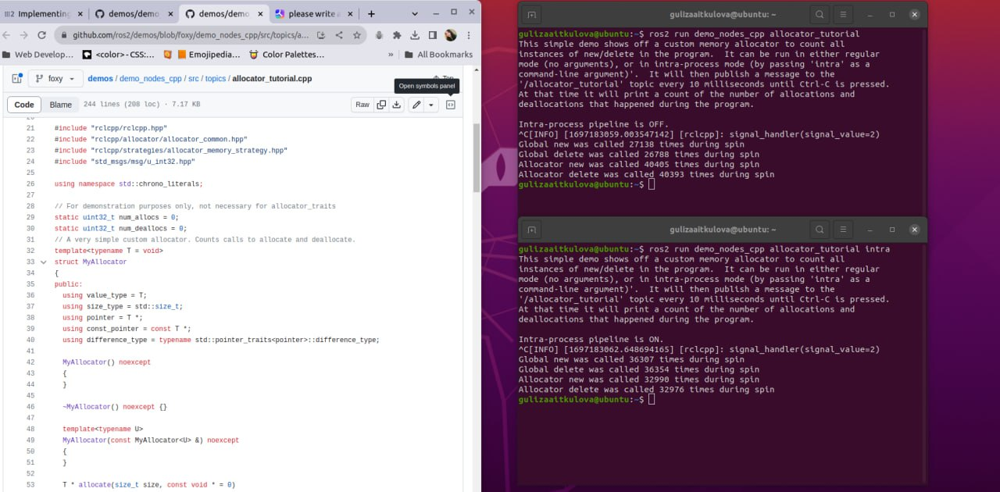

#### README - ROS tutorials - Advanced - Implementing a custom memory allocator
#### 12204505 Guliza Aitkulova

This tutorial is mainly about:

- Custom memory allocator: How to use a custom allocator for ROS 2 C++ code to avoid calling the default heap allocator, which is nondeterministic and not real-time safe.
- C++ allocator interface: How to write a custom allocator that is compatible with the C++ standard library allocator interface and the ROS 2 allocator interface, using allocator_traits or boilerplate code.
- Passing the allocator: How to pass the custom allocator as a shared pointer to publishers, subscribers, and the executor, and how to use it to allocate messages.
- IntraProcessManager: How to expose and pass the custom allocator to the IntraProcessManager, which handles communication between publishers and subscribers in the same process.
- Verifying the allocator: How to count the calls to the custom allocator's allocate and deallocate functions, and compare them to the calls to new and delete, to check if the custom allocator is working as expected.
- TLSF allocator: How to use the TLSF (Two Level Segregate Fit) allocator, which is designed for real-time applications, and where to find a working example of it.

After executing the commands from the shell file, here are the relevant output screenshots:
