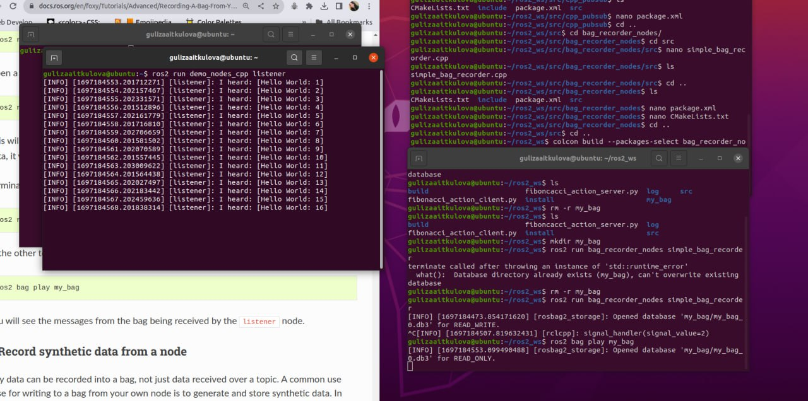
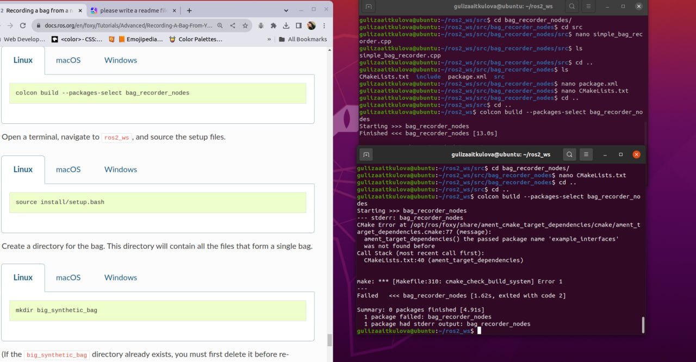
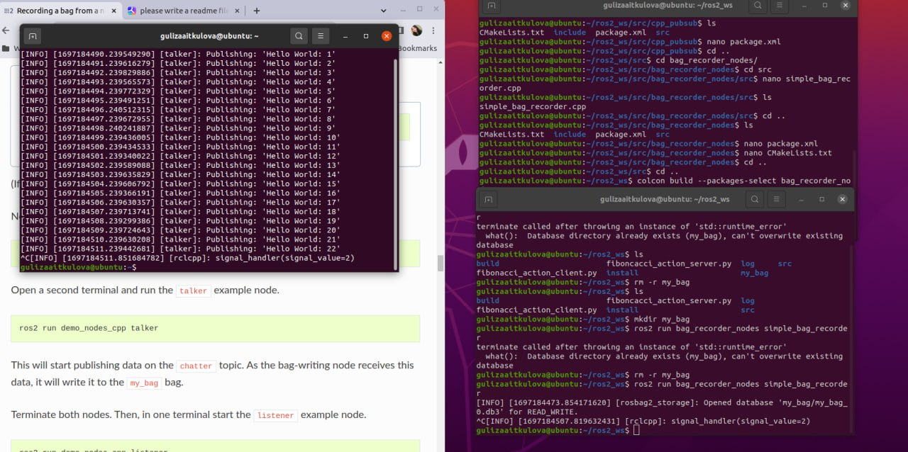

#### README - ROS tutorials - Advanced - Recording a bag from a node (C++)
### 12204505 Guliza Aitkulova

The shell script file contains instructions for installing and running ROS tutorials related to recording a bag from a node in C++.

## Prerequisites

- ROS Foxy
- `rosbag2` packages

## Installation

1. Install the `rosbag2` packages by running the following command:

   ```
   sudo apt install ros-foxy-rosbag2
   ```

2. Clone the ROS workspace:

   ```
   cd ~
   git clone <ros_workspace_url>
   ```

## Usage

1. Create a new package:

   ```
   cd ~/ros2_ws
   ros2 pkg create --build-type ament_cmake bag_recorder_nodes --dependencies rclcpp rosbag2_cpp example_interfaces
   ```

2. Update the `package.xml` file with the following information:

   - Description: C++ bag writing tutorial
   - Maintainer: Your Name (you@email.com)
   - License: Apache License 2.0

3. Write the C++ node:

   ```
   cd ~/ros2_ws/src/bag_recorder_nodes/src
   touch simple_bag_recorder.cpp
   ```

   Copy and paste the following code into the `simple_bag_recorder.cpp` file:

   ```cpp
   <code snippet>
   ```

4. Add the executable to the `CMakeLists.txt` file:

   ```
   cd ..
   echo "add_executable(simple_bag_recorder src/simple_bag_recorder.cpp)
   ament_target_dependencies(simple_bag_recorder rclcpp rosbag2_cpp)

   install(TARGETS
     simple_bag_recorder
     DESTINATION lib/${PROJECT_NAME}
   )" > CMakeLists.txt
   ```

5. Build the package:

   ```
   cd ~/ros2_ws
   colcon build --packages-select bag_recorder_nodes
   ```

6. Source the setup files:

   ```
   source install/setup.bash
   ```

7. Run the bag recorder node:

   ```
   ros2 run bag_recorder_nodes simple_bag_recorder
   ```

   This will start recording a bag from the `chatter` topic.

8. To stop the recording, press `Ctrl+C`.

9. To play the recorded bag, run the following command:

   ```
   ros2 bag play my_bag
   ```

   This will play the bag and publish the messages on the `chatter` topic.

## Additional Nodes

### Data Generator Node

To generate synthetic data and record it in a bag, follow these steps:

1. Create a new node:

   ```
   cd ~/ros2_ws/src/bag_recorder_nodes/src
   touch data_generator_node.cpp
   ```

   Copy and paste the following code into the `data_generator_node.cpp` file:

   ```cpp
   <code snippet>
   ```

2. Add the executable to the `CMakeLists.txt` file:

   ```
   cd ..
   echo "add_executable(data_generator_node src/data_generator_node.cpp)
   ament_target_dependencies(data_generator_node rclcpp rosbag2_cpp example_interfaces)

   install(TARGETS
     data_generator_node
     DESTINATION lib/${PROJECT_NAME}
   )" > CMakeLists.txt
   ```

3. Build the package:

   ```
   cd ~/ros2_ws
   colcon build --packages-select bag_recorder_nodes
   ```

4. Source the setup files:

   ```
   source install/setup.bash
   ```

5. Run the data generator node:

   ```
   ros2 run bag_recorder_nodes data_generator_node
   ```

   This will generate synthetic data and record it in a bag named `timed_synthetic_bag`.

6. To play the recorded bag, run the following command:

   ```
   ros2 bag play timed_synthetic_bag
   ```

   This will play the bag and publish the messages on the `/synthetic` topic.

### Data Generator Executable

To generate a large amount of synthetic data and record it in a bag, follow these steps:

1. Create a new executable:

   ```
   cd ~/ros2_ws/src/bag_recorder_nodes/src
   touch data_generator_executable.cpp
   ```

   Copy and paste the following code into the `data_generator_executable.cpp` file:

   ```cpp
   <code snippet>
   ```

2. Add the executable to the `CMakeLists.txt` file:

   ```
   cd ..
   echo "add_executable(data_generator_executable src/data_generator_executable.cpp)
   ament_target_dependencies(data_generator_executable rclcpp rosbag2_cpp example_interfaces)

   install(TARGETS
     data_generator_executable
     DESTINATION lib/${PROJECT_NAME}
   )" > CMakeLists.txt
   ```

3. Build the package:

   ```
   cd ~/ros2_ws
   colcon build --packages-select bag_recorder_nodes
   ```

4. Source the setup files:

   ```
   source install/setup.bash
   ```

5. Run the data generator executable:

   ```
   ros2 run bag_recorder_nodes data_generator_executable
   ```

   This will generate a large amount of synthetic data and record it in a bag named `big_synthetic_bag`.

6. To play the recorded bag, run the following command:

   ```
   ros2 bag play big_synthetic_bag
   ```

   This will play the bag and publish the messages on the `/synthetic` topic.

```

When trying to build and run the second and the third nodes, i had errors during colcon build, but here is the output screenshots of the successful execution of other packages




