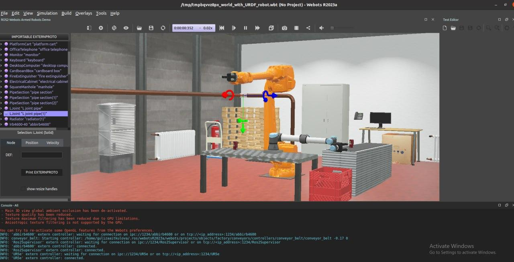
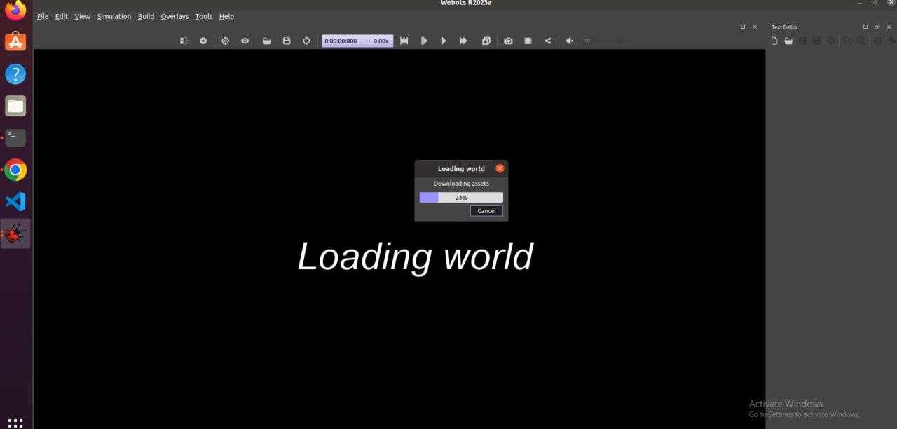
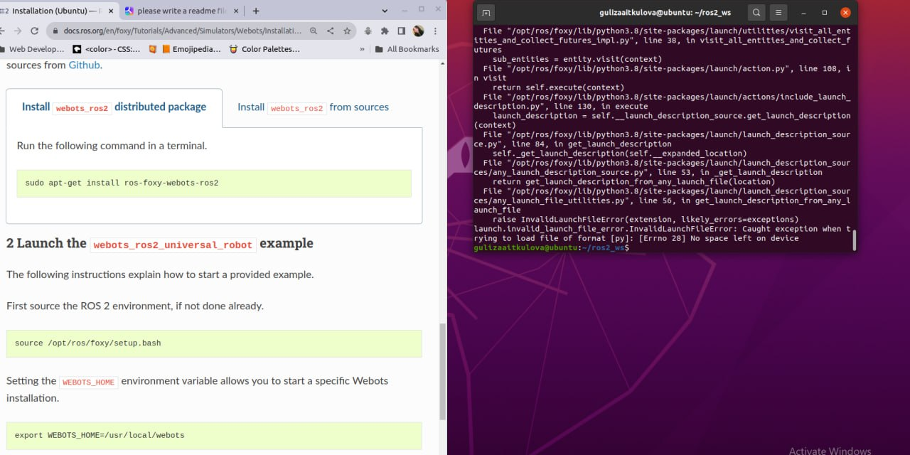

#### README - ROS tutorials - Advanced - Installing webots_ros2 
### 12204505 Guliza Aitkulova

### Prerequisites

Before running the script, make sure you have the following installed:

- ROS Foxy
- Webots simulator
- `ros-foxy-webots-ros2` package

### Installation

To install the `webots_ros2_universal_robot` package, follow these steps:

1. Open a terminal and navigate to the directory where you want to clone the repository.
2. Clone the repository by running the following command:
   ```bash
   git clone https://github.com/cyberbotics/webots_ros2.git
   ```
3. Install the `ros-foxy-webots-ros2` package by running the following command:
   ```bash
   sudo apt-get install ros-foxy-webots-ros2
   ```

### Running the Script

To run the script, follow these steps:

1. Open a terminal and navigate to the directory where the script is located.
2. Make the script executable by running the following command:
   ```bash
   chmod +x script_name.sh
   ```
   Replace `script_name.sh` with the actual name of your script file.
3. Run the script by executing the following command:
   ```bash
   ./script_name.sh
   ```
   Replace `script_name.sh` with the actual name of your script file.

### Additional Notes

- The script assumes that you have set up your ROS workspace (`ros2_ws`) and sourced the necessary setup files.
- The script sets the `WEBOTS_HOME` environment variable to the installation directory of Webots. Make sure to adjust the path if necessary.
- The script launches the `webots_ros2_universal_robot` package using the `multirobot_launch.py` file.

First, I encountered a problem with los disk space. But after a long google searching and asking friends for help, I could launch the demo program



