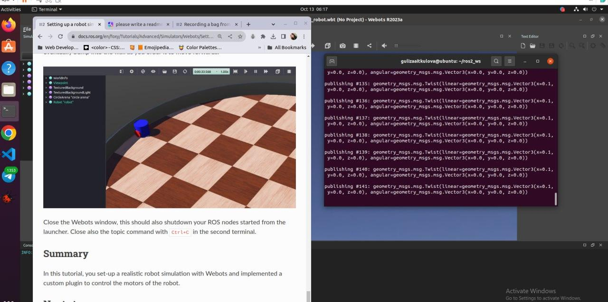

#### README - ROS tutorials - Advanced - Setting up a robot simulation (Basic)
### 12204505 Guliza Aitkulova

### Script Description

The shell script file is designed to set up a robot simulation using ROS (Robot Operating System). It creates a package, sets up the necessary files and directories, and launches the robot simulation.

### Instructions

To use this script, follow these steps:

1. Make sure you have ROS installed on your system.
2. Create a ROS workspace (e.g., `ros2_ws`) and navigate to its source directory.
3. Create a new shell script file (e.g., `setup_robot_simulation.sh`) and copy the contents of the provided script into it.
4. Make the shell script file executable by running the following command: `chmod +x setup_robot_simulation.sh`.
5. Run the shell script by executing the following command: `./setup_robot_simulation.sh`.
6. The script will create the necessary files and directories, download a world file (`my_world.wbt`), and set up the robot simulation.
7. Once the script has finished running, you can launch the robot simulation by running the following command: `ros2 launch my_package robot_launch.py`.
8. To control the robot, you can publish commands to the `/cmd_vel` topic. For example, you can use the following command to make the robot move forward: `ros2 topic pub /cmd_vel geometry_msgs/Twist "linear: { x: 0.1 }"`.

### File Structure

The script creates the following files and directories:

- `ros2_ws/src/my_package`: The package directory.
- `ros2_ws/src/my_package/launch`: The launch file directory.
- `ros2_ws/src/my_package/worlds`: The world file directory.
- `ros2_ws/src/my_package/resource`: The resource file directory.
- `ros2_ws/src/my_package/my_robot_driver.xml`: The XML file for the robot driver plugin.
- `ros2_ws/src/my_package/include/my_package/MyRobotDriver.hpp`: The header file for the robot driver.
- `ros2_ws/src/my_package/src/MyRobotDriver.cpp`: The source file for the robot driver.
- `ros2_ws/src/my_package/resource/my_robot.urdf`: The URDF file for the robot.
- `ros2_ws/src/my_package/launch/robot_launch.py`: The launch file for the robot simulation.

### Dependencies

The script requires the following dependencies to be installed:

- ROS 2
- `ament_cmake`
- `rclcpp`
- `geometry_msgs`
- `webots_ros2_driver`
- `pluginlib`

Make sure these dependencies are installed before running the script.

### Building and Running

After running the script, you can build and run the package by following these steps:

1. Navigate to the ROS workspace directory (`ros2_ws`).
2. Build the package by running the following command: `colcon build --packages-select my_package`.
3. Source the setup file by running the following command: `source install/local_setup.bash`.
4. Launch the robot simulation by running the following command: `ros2 launch my_package robot_launch.py`.
5. You can control the robot by publishing commands to the `/cmd_vel` topic. For example, you can use the following command to make the robot move forward: `ros2 topic pub /cmd_vel geometry_msgs/Twist "linear: { x: 0.1 }"`.

That's it! You should now have a robot simulation up and running.

Here are the output screenshots

